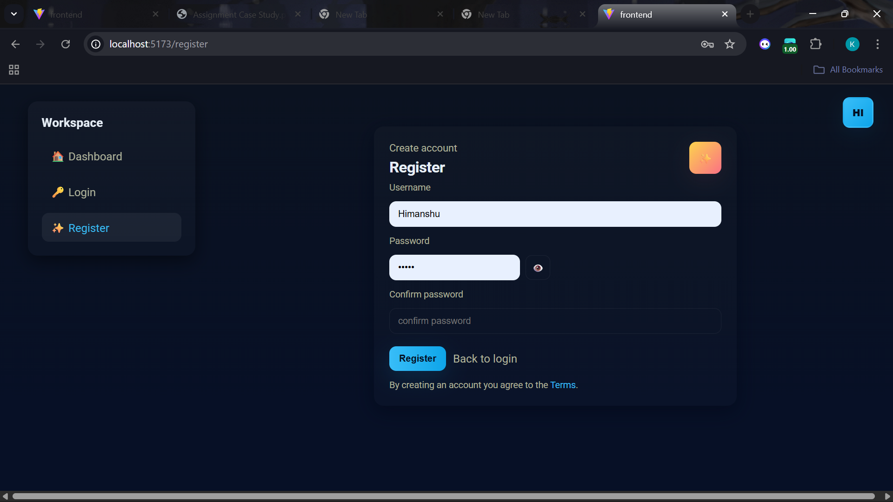

# 🚀 Task Manager App — MERN Stack

A lightweight, modular, and production-ready **Task Manager** application built using the **MERN stack**, featuring JWT authentication, protected routes, and a modern, responsive UI.

---

## 📦 Tech Stack

### **Backend**

* Node.js
* Express.js
* MongoDB + Mongoose
* JWT Authentication
* bcrypt (password hashing)

### **Frontend**

* React (Vite)
* Axios
* TailwindCSS
* React Router

---

## 🛠️ 1. Local Setup Instructions

### **Clone the repository**

```bash
git clone https://github.com/YOUR_USERNAME/task-manager-app.git
cd task-manager-app
```

---

## 🔧 Backend Setup

```bash
cd backend
npm install
```

### **Create a `.env` file** inside the `backend/` directory:

```env
MONGO_URI=<your-mongodb-uri>
JWT_SECRET=<your-secret>
PORT=5000
```

### **Start the backend server**

```bash
npm run dev
```

Backend will run at:
👉 **[http://localhost:5000](http://localhost:5000)**

---

## 🎨 Frontend Setup

```bash
cd ../frontend
npm install
npm run dev
```

Frontend will run at:
👉 **[http://localhost:5173](http://localhost:5173)**

---

## ▶️ 2. How to Run the Application

### **Start Backend**

```bash
cd backend
npm run dev
```

### **Start Frontend**

```bash
cd frontend
npm run dev
```

Open browser at:
👉 **[http://localhost:5173](http://localhost:5173)**

---

## 🧪 3. Running Tests & Viewing Coverage

*(Use these only if your project includes tests.)*

### **Run tests**

```bash
npm test
```

### **Generate coverage report**

```bash
npm run test:coverage
```

Coverage report will be available at:
👉 `/coverage/index.html`

---

## 🖼️ Screenshots

> Copy these images into a `screenshots/` folder in the repo root (or `frontend/public/screenshots/` if you prefer). The README references them as `screenshots/<name>.png`.

* **Dashboard page**


* **Login page**


* **Register / Signup page**



---

## 📡 4. API Endpoint Documentation

### 🔐 **Authentication**

#### **POST `/api/register`**

Register a new user.

**Request Body**

```json
{
  "username": "user123",
  "password": "password"
}
```

---

#### **POST `/api/login`**

Login and receive JWT token.

**Request Body**

```json
{
  "username": "user123",
  "password": "password"
}
```

**Response**

```json
{
  "token": "JWT_TOKEN"
}
```

Use the token in protected routes:

```
Authorization: Bearer <token>
```

---

### 📝 **Tasks**

#### **GET `/api/tasks`**

Get all tasks for the authenticated user.

---

#### **POST `/api/tasks`**

Create a new task.

**Request Body**

```json
{
  "title": "New Task"
}
```

---

#### **PUT `/api/tasks/:id`**

Update task title, status, or description.

**Example Body**

```json
{
  "status": "completed"
}
```

---

#### **DELETE `/api/tasks/:id`**

Delete a specific task.

---

## 🗂️ 5. Project Structure

```
task-manager-app/
│
├── backend/
│   ├── routes/
│   ├── controllers/
│   ├── middleware/
│   ├── models/
│   └── server.js
│
└── frontend/
    ├── src/
    │   ├── pages/
    │   ├── components/
    │   ├── api/
    │   └── App.jsx
```

